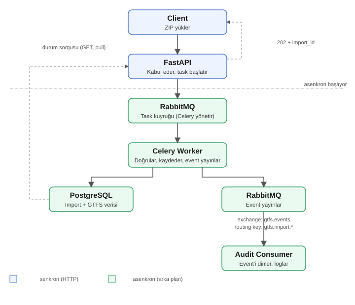
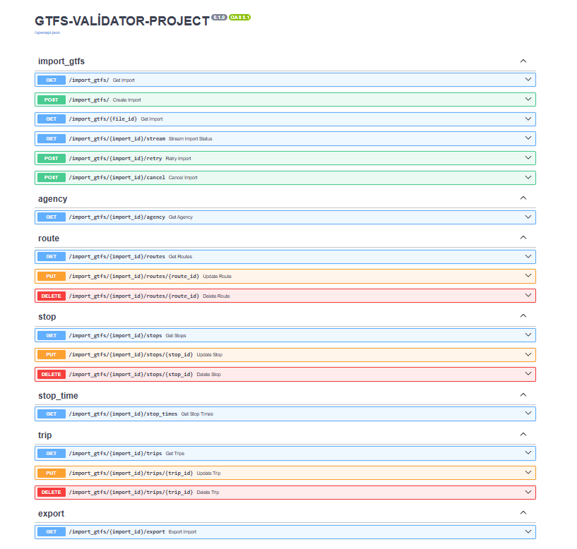
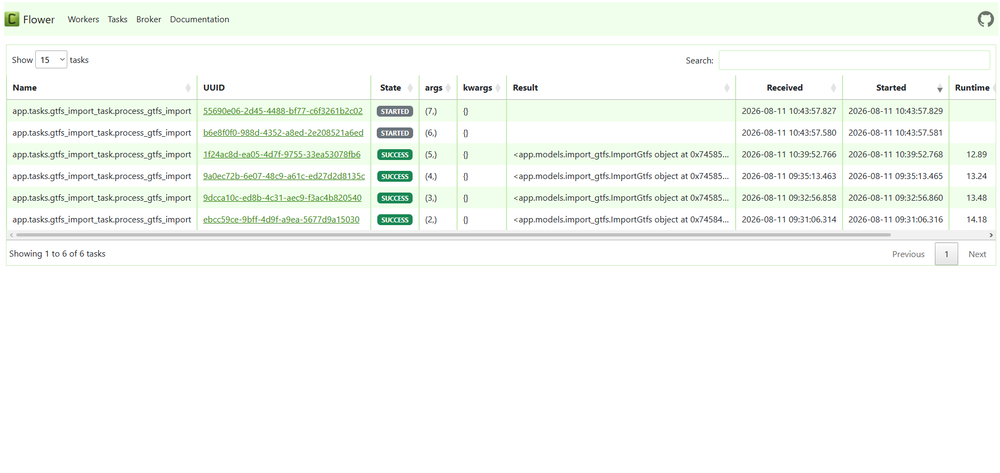
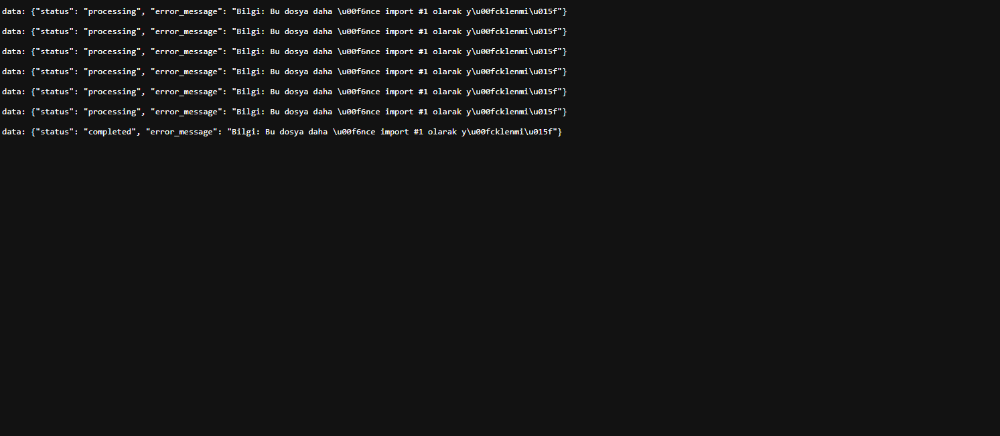

# GTFS Feed Processing Service

GTFS formatındaki toplu taşıma verisi (.zip) yükleme, arka planda asenkron olarak doğrulama ve veritabanına kaydetme yapan bir backend servisi. FastAPI, Celery, RabbitMQ ve PostgreSQL kullanılarak, event-driven bir mimariyle geliştirilmiştir.

## Mimari


## Swagger Arayüzü


## Celery İzleme Paneli (Flower)
Celery worker'ların ve task'ların durumu, Flower ile görsel olarak izlenebilir:
`http://localhost:5555`



## Kullanılan Teknolojiler

- **FastAPI** — REST API framework
- **SQLAlchemy** — ORM
- **Alembic** — veritabanı migration yönetimi
- **PostgreSQL** — veritabanı
- **Celery** — asenkron görev kuyruğu (arka plan işleme)
- **RabbitMQ** — mesaj broker (task kuyruğu + event yayınlama)
- **Flower** — Celery task/worker izleme paneli
- **pandas** — GTFS CSV dosyalarının okunması, doğrulanması, büyük dosyalar için parçalı (chunked) okuma
- **pika** — RabbitMQ ile doğrudan event yayınlama/dinleme
- **Pydantic Settings** — merkezi, tip güvenli env değişkeni yönetimi
- **Docker & Docker Compose** — tüm sistemin (api, worker, postgres, rabbitmq, flower) tek komutla ayağa kaldırılması
- **pytest** — unit ve integration testler

## Proje Yapısı

```
app/
├── main.py                     # Uygulama girişi
├── config.py                    # Pydantic Settings ile .env okuma
├── dependencies.py               # get_db
├── db/
│   └── database.py                  # SQLAlchemy engine, SessionLocal, Base
├── models/
│   ├── import_gtfs.py                 # ImportGtfs modeli, ImportStatus enum
│   ├── agency.py, route.py, stop.py, trip.py, stop_time.py   # GTFS veri modelleri
├── schemas/
│   └── (her model için Response şeması)
├── services/
│   ├── import_gtfs.py                # Import CRUD + GTFS veri sorgulama (routes/stops/trips/stop_times) + SSE stream
│   ├── gtfs_data_save.py             # Agency/Route/Stop/Trip kaydetme
│   └── gtfs_data_bulk_save.py        # StopTime kaydetme (chunked + bulk insert)
├── routers/
│   └── import_gtfs.py                # Tüm endpoint'ler
├── tasks/
│   ├── celery_app.py                  # Celery kurulumu
│   ├── gtfs_import_task.py            # Orkestratör: doğrula → kaydet → durumu güncelle → event yayınla
│   ├── zip_utils.py                   # Güvenli ZIP açma (path traversal + zip bomb koruması)
│   └── checksum_utils.py              # Dosya checksum hesaplama (SHA256)
├── validation/
│   └── gtfs_validator.py              # Tüm GTFS doğrulama fonksiyonları
├── events/
│   └── publisher.py                   # RabbitMQ event yayınlama
└── consumers/
    └── audit_consumer.py              # Event'leri dinleyen örnek consumer
alembic/                          # Migration dosyaları
tests/
├── test_validation.py              # Unit testler (validasyon fonksiyonları)
└── test_api.py                     # Integration testler (endpoint'ler)
Dockerfile
docker-compose.yml
requirements.txt
.env.example
```

## Temel İş Akışı

1. Kullanıcı `POST /import_gtfs/` ile bir GTFS `.zip` dosyası yükler.
2. API dosyayı `uploads/zips/` altına (benzersiz isimle) kaydeder, dosyanın checksum'ını (SHA256) hesaplar, veritabanında bir `ImportGtfs` kaydı oluşturur (`status: uploaded`) ve kullanıcıya bir `import_id` döner (senkron, anında dönüş).
3. Celery worker'a `process_gtfs_import` task'ı gönderilir (asenkron).
4. Worker:
   - Aynı checksum'a sahip daha önceki bir import varsa bunu tespit edip bilgilendirir (işlemi engellemez)
   - ZIP'i güvenli şekilde açar (path traversal ve zip bomb kontrolü ile)
   - GTFS dosyalarını kapsamlı şekilde doğrular (bkz. aşağıdaki liste)
   - Doğrulama başarılıysa, gerçek GTFS verisini (agency, routes, stops, trips, stop_times) veritabanına kaydeder — `stop_times` büyük olabileceği için parçalı (chunked) okunur ve toplu (bulk) yazılır
   - Durumu günceller: `completed`, `completed_with_warnings` (veri kalitesi uyarıları varsa) veya `failed`
   - RabbitMQ'ya bir event yayınlar (`gtfs.import.completed` / `gtfs.import.failed`)
5. Kullanıcı `GET /import_gtfs/{id}` ile durumu istediği an sorgulayabilir, ya da `GET /import_gtfs/{id}/stream` ile durumu sayfa yenilemeden, gerçek zamanlı (Server-Sent Events) izleyebilir. İşlem tamamlandıysa `GET /import_gtfs/{id}/routes`, `/stops`, `/trips`, `/stop_times`, `/agency` ile işlenmiş veriyi görüntüleyebilir (`stop_times` için `limit`/`offset` ile sayfalama desteklenir).

## GTFS Doğrulama Katmanı

- Zorunlu dosyaların varlığı (agency, stops, routes, trips, stop_times; calendar/calendar_dates'ten en az biri)
- Zorunlu kolonların varlığı
- Referans bütünlüğü: trip→route, stop_time→trip, stop_time→stop, trip→service (calendar/calendar_dates)
- Tekrarlanan birincil ID kontrolü (stop_id, route_id, trip_id)
- stop_sequence tekrar kontrolü (aynı trip içinde)
- Koordinat geçerliliği (stop_lat: -90/90, stop_lon: -180/180)
- Tarih format geçerliliği (calendar.txt start_date/end_date)
- Saat format ve mantıklılık kontrolü (stop_times arrival_time/departure_time, GTFS'in 24 saati aşabilen saat kuralına uygun şekilde regex ile)
- Veri kalitesi uyarıları (boş stop_name, boş route_short_name gibi durumlar → `completed_with_warnings`)
- Checksum ile aynı dosyanın tekrar yüklendiğinin tespiti (SHA256)

## Tasarım Kararları

- **Senkron / asenkron ayrımı:** API katmanı sadece isteği kabul edip hemen cevap döner, ağır işlem tamamen Celery worker'a devredilir.
- **Durum takibi (pull) vs event (push):** `status` alanı kullanıcının istediği an sorgulayabileceği kalıcı bir bilgidir; event ise worker'ın işini bitirince kendiliğinden yayınladığı, ayrı bir bildirim mekanizmasıdır. `/stream` endpoint'i, pull ile push arasında bir orta yol sunar: kullanıcı tekrar tekrar sormaz, ama sunucu da tek bir mesajla yetinmeyip durum değişene kadar akış gönderir.
- **Event exchange/routing key:** `exchange: gtfs.events` (topic tipi), `routing key: gtfs.import.*`. Örnek bir audit consumer (`app/consumers/audit_consumer.py`), bu event'leri dinleyip loglayarak mimarinin uçtan uca çalıştığını gösterir.
- **GTFS verisinin kendi ID'leri (`stop_id`, `trip_id` vb.) veritabanında ayrı bir `id` (kendi primary key'imiz) ile tutulur** — çünkü aynı GTFS ID'si farklı import'lar arasında çakışabilir; her satır ayrıca `import_id` foreign key'i ile hangi import'a ait olduğunu taşır.
- **Referans bütünlüğü veritabanı seviyesinde değil, validasyon aşamasında (pandas ile) kontrol edilir** — bulk insert performansını korumak için.
- **Hata yönetimi:** Servis katmanında `HTTPException` fırlatma prensibi benimsenmiştir; worker/validasyon katmanında ise `ValueError` kullanılır ve `error_message` alanına yazılır (HTTP isteğinden bağımsız oldukları için).
- **Idempotency:** Aynı task tekrar tetiklenirse (retry sonucu), zaten `completed`/`failed` durumundaki bir import yeniden işlenmez.
- **Retry:** Geçici altyapı hataları (`OperationalError`, `AMQPConnectionError`) otomatik olarak yeniden denenir (`retry_backoff`, `max_retries=3`); kalıcı hatalar (validasyon hataları) yeniden denenmez.
- **Docker'da paylaşılan dosya erişimi:** `api` ve `worker` servisleri izole konteynerler olduğu için diskleri de birbirinden bağımsızdır; bu yüzden `uploads/` klasörü, `docker-compose.yml` içinde bir named volume ile iki servis arasında paylaşılır.
- **SSE endpoint'i kendi veritabanı session'ını yönetir:** `/stream` endpoint'i uzun süre açık kalabildiğinden, her periyodik kontrolde ayrı bir session açılıp hemen kapatılır; böylece bağlantı, veritabanı bağlantı havuzunu gereksiz yere uzun süre işgal etmez.

## Import Durumları

| Durum | Açıklama |
|---|---|
| `uploaded` | Dosya alındı |
| `queued` | Görev kuyrukta bekliyor |
| `processing` | Worker dosyayı işliyor |
| `completed` | Başarıyla tamamlandı |
| `completed_with_warnings` | Tamamlandı, veri kalitesi uyarıları var |
| `failed` | İşlem başarısız oldu, detay için `error_message`'a bakın |

## Canlı Durum Takibi (SSE)

Bir import'un durumu, sayfa yenilemeden, gerçek zamanlı olarak takip edilebilir:

`GET /import_gtfs/{import_id}/stream`

Bu endpoint, Server-Sent Events (SSE) protokolü ile, import işlemi tamamlanana kadar periyodik olarak (2 saniyede bir) güncel durumu akış halinde gönderir.



## Kurulum ve Çalıştırma (Docker Compose, önerilen)

`.env` dosyasını oluşturun (bkz. `.env.example`), sonra tek komutla tüm sistemi (API, Celery worker, PostgreSQL, RabbitMQ, Flower) ayağa kaldırın:

```bash
docker compose up --build
```

Migration'lar, `api` servisi başlarken otomatik olarak uygulanır.

- API: `http://localhost:8000`
- Swagger dokümantasyonu: `http://localhost:8000/docs`
- RabbitMQ yönetim paneli: `http://localhost:15672`
- Flower (Celery izleme paneli): `http://localhost:5555`

Kod değişiklikleri, `api` ve `worker` servislerine bind mount edildiğinden, API `--reload` ile otomatik yenilenir; `worker` için `docker compose restart worker` yeterlidir. `requirements.txt` veya `Dockerfile` değişikliklerinde `docker compose up --build` ile yeniden inşa edilmesi gerekir.

## Kurulum (Docker'sız, geliştirme alternatifi)

```bash
python -m venv venv
venv\Scripts\activate
pip install -r requirements.txt
```

PostgreSQL ve RabbitMQ'yu geçici Docker konteynerleriyle ayağa kaldırın:

```bash
docker run --name gtfs-postgres -e POSTGRES_USER=kullanici -e POSTGRES_PASSWORD=sifre -e POSTGRES_DB=gtfs_db -p 5432:5432 -d postgres
docker run --name gtfs-rabbitmq -p 5672:5672 -p 15672:15672 -d rabbitmq:3-management
```

Migration'ları uygulayın:

```bash
alembic upgrade head
```

Üç ayrı terminalde çalıştırın:

```bash
uvicorn app.main:app --reload
celery -A app.tasks.celery_app worker --loglevel=info --pool=solo
python -m app.consumers.audit_consumer   # opsiyonel, event akışını izlemek için
```

## Testler

Unit testler (validasyon fonksiyonları, `pytest`'in `tmp_path` özelliğiyle izole test verisi kullanır) ve integration testler (`FastAPI TestClient` ile uçtan uca endpoint testleri) mevcuttur.

```bash
pytest tests/ -v
```

PostgreSQL ve RabbitMQ'nun ayakta olması gerekir (integration testler gerçek veritabanına bağlanır).

## Örnek GTFS Dosyaları

`samples/` klasöründe, sistemi test etmek için kullanılan örnek GTFS ZIP dosyaları bulunur:

- `GTFS_CCRTA.zip` — gerçek dünyadan, büyük bir toplu taşıma feed'i (temiz, chunked okuma ve performans testleri için)
- `gtfs_bozuk_koordinat.zip` — geçersiz stop_lat/stop_lon değerleri içerir
- `gtfs_bozuk_saat.zip` — geçersiz arrival_time/departure_time formatı içerir
- `gtfs_bozuk_service.zip` — trips.txt'te geçersiz service_id referansı içerir
- `gtfs_sadece_koordinat_bozuk.zip` — sadece koordinat hatası içeren izole test dosyası
- `gtfs_tekrarli_stop.zip` — tekrarlanan stop_id içerir

Bu dosyaları `POST /import_gtfs/` endpoint'ine yükleyerek, hem başarılı bir import akışını hem de validasyon katmanının farklı hata senaryolarını nasıl yakaladığını test edebilirsiniz.
